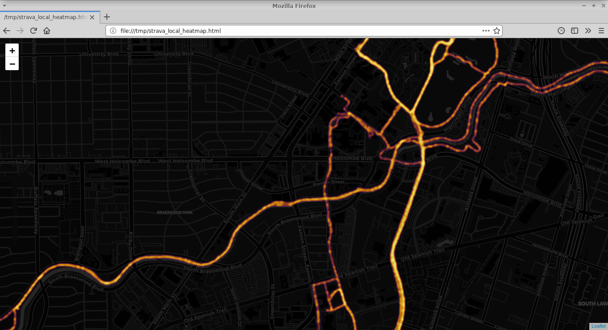

# strava_local_heatmap_browser.py
Python script to reproduce the Strava Global Heatmap ([www.strava.com/heatmap](https://www.strava.com/heatmap)) with local GPX files



## Features

* Minimal Python dependencies ([folium](https://github.com/python-visualization/folium))
* Fast (3x faster than `gpxpy.parse()`)

## Usage

* Download your GPX files from Strava to the `gpx` folder  
(see https://support.strava.com/hc/en-us/articles/216918437-Exporting-your-Data-and-Bulk-Export)
* Run `python3 strava_local_heatmap_browser.py`

### Command-line options
```
usage: strava_local_heatmap_browser.py [-h] [--gpx-dir DIR] [--gpx-filter FILTER] [--skip-ratio N] [--light-map]
                                       [--output FILE] [--radius RADIUS] [--blur BLUR] [--min-opacity OPACITY]
                                       [--max-val VAL] [--quiet]

optional arguments:
  -h, --help            show this help message and exit
  --gpx-dir DIR         directory containing the GPX files (default: gpx)
  --gpx-filter FILTER   glob filter for the GPX files (default: *.gpx)
  --skip-ratio N        read every other N point of each GPX file (default: 1)
  --light-map           use light map background
  --output FILE         output html file (default: strava_local_heatmap.html)
  --radius RADIUS       radius of trackpoints in pixels (default: 2)
  --blur BLUR           amount of blur in pixels (default: 2)
  --min-opacity OPACITY
                        minimum opacity value (default: 0.3)
  --max-val VAL         maximum point intensity (default: 1.0)
  --quiet               quiet output
```

## Python dependencies
* folium

### Setup

* `pip3 install --user --requirement requirements.txt`
